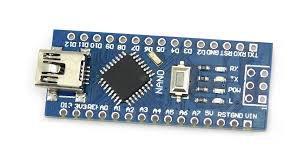
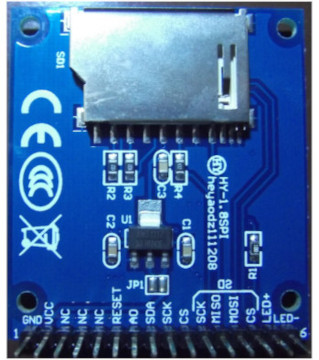

# weekend-flap

> My daughter wants to play with my arduino and found this game article - [Flappy Bird Clone on the ATmega328 (Arduino UNO)](https://www.mrt-prodz.com/blog/view/2015/03/flappy-bird-clone-on-the-atmega328-arduino-uno). Tried it but it didnt work, and here is the updated sketch that made it work. At the time of this writing, Im using Arduino 1.8.9, Adafruit-ST7735-Library 1.3.4.

## Bill Of Materials

1. Arduino Nano

2. 1.8 TFT 128X160 SPI V1.0

## Wiring

| TFT Module   | Nano         |
| ------------ | ------------ |
| GND          | GND          |
| VCC          | 5V           |
| RESET        | D8           |
| A0           | D9           |
| SDA          | D11          |
| SCK          | D13          |
| CS           | D10          |
| CS           | D10          |
| LED+         | 3V3          |
| LED-         | GND          |
